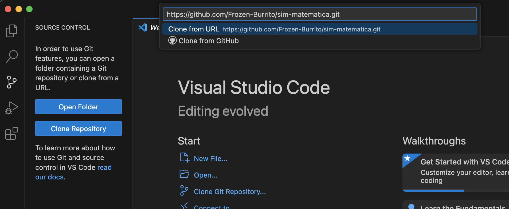

# Proyecto 1

Integrantes del equipo:

- Mónica Lizette Cardona Solís
- Marianna Montserrat Curiel Zambrano
- Fernando Mendoza Velasco

**TODO: Descripción breve del proyecto**

## Dataset

Publicado por el usuario "Ryan Dinh" como [Agricultural Production Optimization](https://www.kaggle.com/datasets/ryandinh/agricultural-production-optimization/data) en Kaggle. Consultado el 25 de febrero de 2025, última actualización en 2024.

## Get Started

Aunque puede contribuirse al proyecto desde cualquier IDE, los siguientes pasos usan VS Code.

### 1. Clonar repositorio

Desde VS Code, abre la pestaña "source control" a la izquierda y presiona "Clonar repositorio". Luego, pega la URL de este repositorio:



Después, elige la carpeta donde quieres guardar el repositorio.

También puedes clonar usando el siguiente comando:

```
git clone https://github.com/Frozen-Burrito/sim-matematica.git
```

Después de clonar, puedes abrir el repositorio en tu IDE de preferencia.

### 2. Configurar el entorno

Este proyecto usa Python para el análisis de datos y la optimización. Descarga e instala Python 3, si no lo tienes instalado ya.

Recomendamos usar un entorno virtual para instalar las dependencias. Para crear un nuevo entorno virtual, ejecuta el siguiente comando desde el directorio raíz del repositorio:

```
python -m venv /path/to/new/virtual/environment
```

Después, usa uno de los comandos de [esta tabla](https://docs.python.org/3/library/venv.html#how-venvs-work) para activar el entorno virtual.

Con el entorno virtual activo, ejecuta el siguiente comando desde el directorio raíz para instalar todos los paquetes usados por el proyecto:

```
pip install -r requirements.txt
```

### 3. Ejecutar el código

Todo el código del proyecto está en el Jupyter Notebook del archivo `ProyectoModulo1_CardonaM_CurielM_MendozaF.ipynb`. Para ejecutar el código en VS Code:

1. Abre el archivo con el Jupyter Notebook. 
2. Elige el kernel de Python.
    
    a. Presiona el botón **Elegir kernel**, en la esquina superior derecha.
  
    b. Presiona la opción **Elegir otro kernel**.
  
    c. Presiona la opción **Entornos de Python...**.
    
    d. En la lista, busca el entorno virtual que creaste y selecciónalo.

3. Presiona el botón con el ícono "play" para ejecutar el código. Puedes ejecutar una celda a la vez, o todas las celdas.

## Metodología

**TODO**

## Bibliografía

**TODO**
